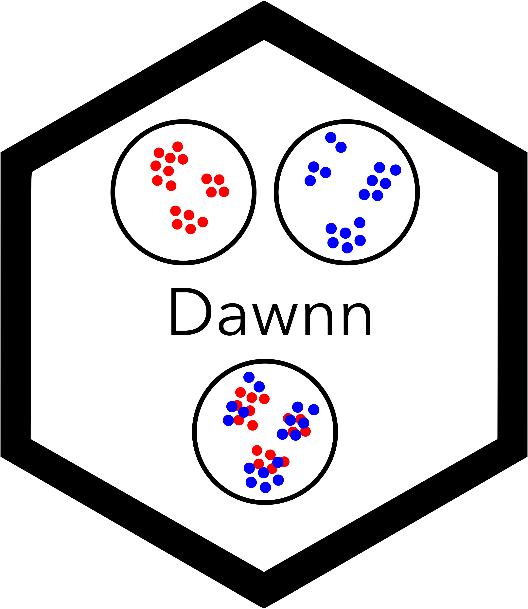

<p align="center">
  
  <br><br>
  Dawnn is a method to detect differential abundance in a single-cell
  transcriptomic dataset.
</p>

### Installation

Dawnn is currently only available from Github:

```
devtools::install_github("george-hall-ucl/dawnn")
```

### How to use

In the following, we assume that `cells` is a Seurat single-cell dataset with
\>1000 cells and a stored PCA dimensionality reduction. We also assume that
each cell has one of two labels (`Condition1` or `Condition2`).

Dawnn can be run with:

```{r}
library(dawnn)
model_path <- download_model() # Only run once per machine, reuse model path
cells <- run_dawnn(cells, label_names = "sample_labels",
                   reduced_dim = "pca", nn_model = model_path)
```

After `run_dawnn()`, the object `cells` has additional metadata for each cell:

| Dawnn output             | Description                                                                                   |
|--------------------------|-----------------------------------------------------------------------------------------------|
| `cells$dawnn_scores`     | Output of Dawnn's model.                                                                      |
| `cells$dawnn_lfc`        | Estimated log2-fold change in its neighbourhood.                                              |
| `cells$dawnn_p_vals`     | P-value associated with the hypothesis test that it is in a region of differential abundance. |
| `cells$dawnn_da_verdict` | Boolean output of Dawnn for whether it is in a region of differential abundance.              |
