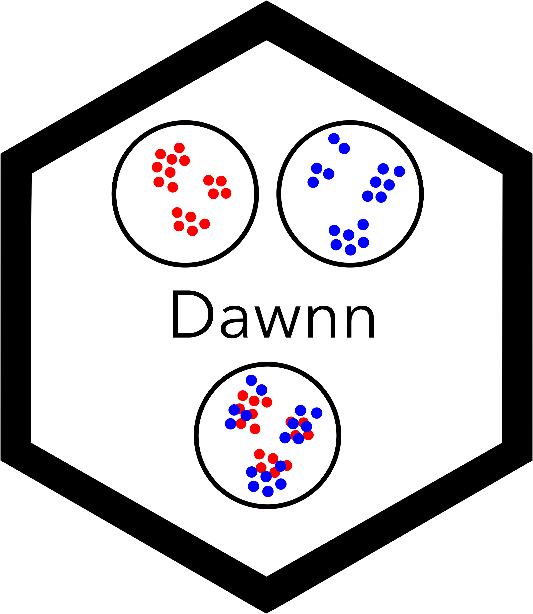

<p align="center">
  
  <br><br>
  Dawnn is a method to detect differential abundance in a single-cell
  transcriptomic dataset.
</p>

### Installation

Dawnn is currently only available from Github.

```{r}
# Step 1: Install Dawnn package
devtools::install_github("george-hall-ucl/dawnn")

# Step 2: Download Dawnn's model
# By default, model stored at ~/.dawnn/dawnn_nn_model.h5
dawnn::download_model()

# Step 3: Install Tensorflow Python package (if necessary)
tensorflow::install_tensorflow()
```

### Quick start

Assume that `cells` is a Seurat dataset with
\>1000 cells, a PCA reduction, and a `meta.data` slot `condition_name` that contains the name of the condition to which each cell belongs (either `Condition1` or `Condition2`).


```{r}
library(dawnn)

cells <- run_dawnn(cells, label_names = "condition_name", label_1 = "Condition1",
                   label_2 = "Condition2", reduced_dim = "pca")
```


After `run_dawnn()`, the object `cells` has additional `meta.data` slots:

| Dawnn output             | Description                                                                                   |
|--------------------------|-----------------------------------------------------------------------------------------------|
| `cells$dawnn_scores`     | Output of Dawnn's model (estimated probability that a cell was drawn from sample with `label_1`)                                                                      |
| `cells$dawnn_lfc`        | Estimated log2-fold change in its neighbourhood.                                              |
| `cells$dawnn_p_vals`     | P-value associated with the hypothesis test that it is in a region of differential abundance. |
| `cells$dawnn_da_verdict` | Boolean output of Dawnn for whether it is in a region of differential abundance.              |

### Optional parameters

The above example only specifies the required parameters. Dawnn can be run in more complex scenarios by setting the following parameters:

```{r}
cells <- run_dawnn(cells = cells, label_names = "condition_name",
                   label_1 = "Condition1", label_2 = "Condition2",
                   reduced_dim = "pca", n_dims = 20,
                   nn_model = "~/Documents/another_nn_model.h5,
                   recalculate_graph = FALSE, alpha = 0.025,
                   verbosity = 0, seed = 42)
```

These parameters are defined in the vignette.
