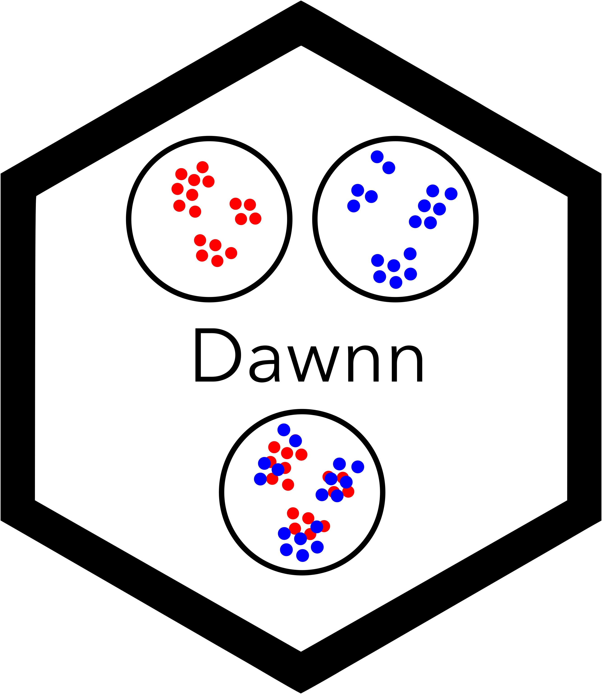

<p align="center">
  
  <br><br>
  Dawnn is a method to detect differential abundance in a single-cell
  transcriptomic dataset.
</p>

### Installation

Dawnn is currently only available from Github.

```{r}
# Step 1: Install Dawnn package (may need to install `remotes` package first)
remotes::install_github("george-hall-ucl/dawnn")

# Step 2: Download Dawnn's model
# By default, model stored at ~/.dawnn/dawnn_nn_model.h5
dawnn::download_model()
```

To solve installation issues, we recommend to run Dawnn using a Docker image to
execute the model. This image can be downloaded from Dockerhub
([georgehallucl/dawnn](https://hub.docker.com/repository/docker/georgehallucl/dawnn/general)).
To run in this way, you must first [install
docker](https://docs.docker.com/get-docker/). When you want to run Dawnn, start
the Docker program and then run Dawnn with the `docker_image` option set to
`"georgehallucl/dawnn"`. We give an example of this in the Quick Start guide
below.

<details>
<summary>Click to reveal instructions to install Dawnn without Docker (not recommended)</summary>

```{r}
# Step 3: Install Tensorflow Python package in Reticulate environment
reticulate::py_install("tensorflow")
```

Note: We are currently experiencing some installation issues on Apple-silicon
(i.e. M1, M2, M3 chip) Macs, which we are trying to fix. See
[here](https://github.com/george-hall-ucl/dawnn/issues/4).

</details>

### Quick start

Assume that `cells` is a Seurat dataset with a PCA reduction, and a `meta.data`
slot `condition_name` that contains the name of the condition to which each
cell belongs (either `Condition1` or `Condition2`). Dawnn requires at least
1,001 cells.

First, start the Docker application. Then run:

```{r}
library(dawnn)

cells <- run_dawnn(cells, label_names = "condition_name", label_1 = "Condition1",
                   label_2 = "Condition2", reduced_dim = "pca",
                   docker_image = "georgehallucl/dawnn")
```

<details>
<summary>Click to reveal instructions to run Dawnn without Docker (not recommended)</summary>
#### Without Docker

```{r}
library(dawnn)

cells <- run_dawnn(cells, label_names = "condition_name", label_1 = "Condition1",
                   label_2 = "Condition2", reduced_dim = "pca")
```

</details>

After `run_dawnn()`, the object `cells` has additional `meta.data` slots:

| Dawnn output             | Description                                                                                   |
|--------------------------|-----------------------------------------------------------------------------------------------|
| `cells$dawnn_scores`     | Output of Dawnn's model (estimated probability that a cell was drawn from sample with `label_1`)                                                                      |
| `cells$dawnn_lfc`        | Estimated log2-fold change in its neighbourhood.                                              |
| `cells$dawnn_p_vals`     | P-value associated with the hypothesis test that it is in a region of differential abundance. |
| `cells$dawnn_da_verdict` | Boolean output of Dawnn for whether it is in a region of differential abundance.              |

Dawnn's
[vignette](https://github.com/george-hall-ucl/dawnn_vignette/blob/main/dawnn.md)
explains these outputs in more detail.

### Optional parameters

The above example only specifies the required parameters. Dawnn can be run in more complex scenarios by setting the following parameters:

```{r}
cells <- run_dawnn(cells = cells, label_names = "condition_name",
                   label_1 = "Condition1", label_2 = "Condition2",
                   reduced_dim = "pca", n_dims = 20,
                   nn_model = "~/Documents/another_nn_model.h5,
                   recalculate_graph = FALSE, alpha = 0.025,
                   verbosity = 0, seed = 42)
```

These parameters are defined in the [vignette](https://github.com/george-hall-ucl/dawnn_vignette/blob/main/dawnn.md).

### Citation

_Dawnn: single-cell differential abundance with neural networks_. George T. Hall and Sergi Castellano (2023). Preprint on [bioRxiv](https://www.biorxiv.org/content/10.1101/2023.05.05.539427v1).

### Contributions

Any contributions are warmly welcomed! Please feel free to submit an issue or pull request on this repository.

### Licence

Copyright (C) 2023-2024 University College London

This program is free software: you can redistribute it and/or modify
it under the terms of the GNU General Public License as published by
the Free Software Foundation, either version 3 of the License, or
(at your option) any later version.

This program is distributed in the hope that it will be useful,
but WITHOUT ANY WARRANTY; without even the implied warranty of
MERCHANTABILITY or FITNESS FOR A PARTICULAR PURPOSE.  See the
GNU General Public License for more details.

You should have received a copy of the GNU General Public License
along with this program.  If not, see <http://www.gnu.org/licenses/>.
