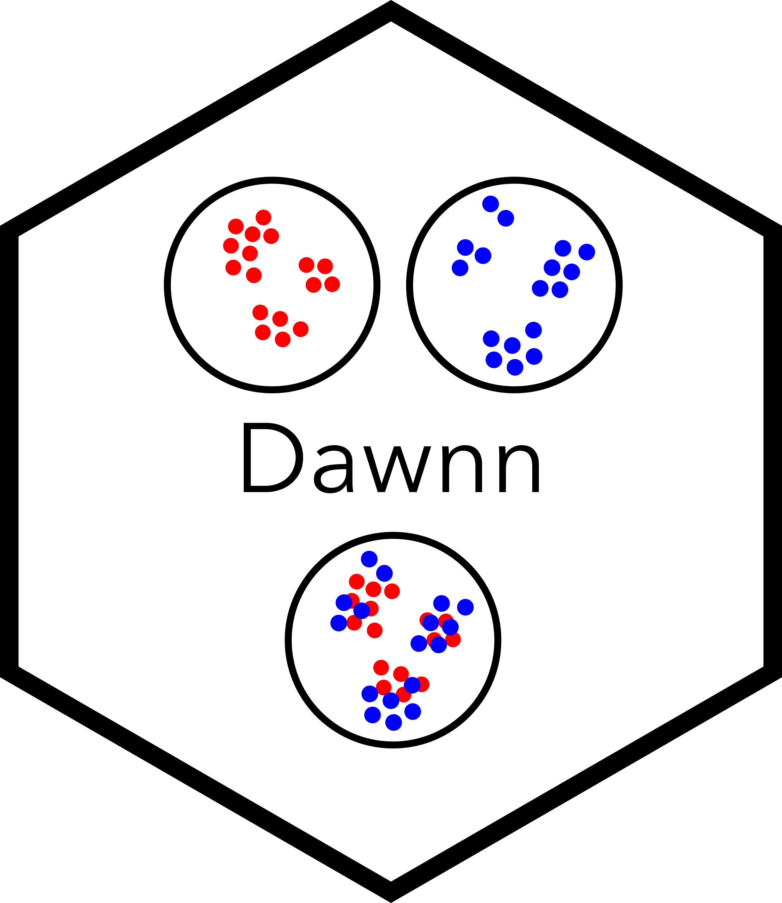

<br>
<p align="center">
  
  <br><br>
  Dawnn is a method to detect differential abundance in a single-cell
  transcriptomic dataset.
</p>

<br>

### Quick start

The easiest way to use Dawnn is with Docker. This avoids you needing to install
the R package or its Python dependencies.

#### Step 0

[Install Docker](https://docs.docker.com/get-started/get-docker/) and start Docker Desktop.

#### Step 1

In R, save your Seurat dataset as an `.rds` object:

```r
saveRDS(my_cells, "my_cells.rds")
```

#### Step 2

In the terminal, run Dawnn though Docker:

```bash
docker run --rm --volume "$(pwd):/tmp/in_mnt" --workdir /tmp/in_mnt \
    georgehallucl/dawnn_standalone '
    run_dawnn(cells = readRDS("my_cells.rds"), label_names = "label",
              label_pos_lfc = "Condition1", reduced_dim = "pca",
              tf_conda_env = "tf_env", verbosity = 1)
' > dawnn_out.csv
```

Dawnn's outputs will be written to `dawnn_out.csv`. Note that Docker will first
automatically download the image the first time it is used.

#### Step 3

Back in R, load Dawnn's outputs in to your Seurat object's metadata:

```r
dawnn_out <- read.csv("dawnn_out.csv")
my_cells@meta.data <- cbind(my_cells@meta.data,
                            dawnn_out[rownames(my_cells@meta.data), ])
```

You can now use Dawnn's outputs to measure differential abundance in your data.
See `run_dawnn()` and `vignette("dawnn")` for more details about its parameters
and outputs.

The following video shows the steps to run Dawnn in Docker:

<video width="800" controls>
  <source src="dawnn_demo_vid.mp4" type="video/mp4">
  Your browser does not support the video tag.
</video>

<br>

### Using Dawnn in R

If you don't want to use Docker, you can install and run Dawnn within R. The
Dawnn package is currently only available from Github. Note that you will need to
install
[conda](https://docs.conda.io/projects/conda/en/latest/user-guide/install/index.html#regular-installation)
for Step 3.

```r
# Step 1: Install Dawnn package (may need to install `remotes` package first)
remotes::install_github("george-hall-ucl/dawnn")

# Step 2: Download Dawnn's model
# By default, model stored at ~/.dawnn/dawnn_nn_model.h5
dawnn::download_model()

# Step 3: Install Tensorflow in own conda environment
conda create -y -n tf_env -c conda-forge python=3.12.4 \
    && conda run -n tf_env pip install tensorflow
```

Assume that `cells` is a Seurat dataset with a PCA reduction, and a `meta.data`
slot `condition_name` that contains the name of the condition to which each
cell belongs (either `Condition1` or `Condition2`) and where we want the label
`Condition1` to be associated with positive log-fold change. Dawnn requires at
least 1,001 cells. We assume that TensorFlow is installed in the `tf_env` conda
environment.

```r
library(Seurat)
library(dawnn)

cells <- run_dawnn(cells, label_names = "condition_name",
                   label_pos_lfc = "Condition1", reduced_dim = "pca",
                   tf_conda_env = "tf_env")
```

Dawnn has other parameters not listed here. For more details, see `run_dawnn()`
and `vignette("dawnn")`.

### Citation

_Dawnn: single-cell differential abundance with neural networks_. George T. Hall and Sergi Castellano (2023). Preprint on [bioRxiv](https://www.biorxiv.org/content/10.1101/2023.05.05.539427v1).

### Contributions

Any contributions are warmly welcomed! Please feel free to submit an issue or pull request on this repository.

### Releases

#### v2.0.0 (16 July 2026)

* Simultaneously test for local and global differential abundance.
* Only take single label from user (since two labels are assumed, the other
  need not be passed).

#### v1.2.0 (15 July 2026)

* Fixed a bug where the `alpha` parameter was not being respected (the default
  value of 0.1 was always being used).

### Licence

Copyright (C) 2023-2026 University College London

This program is free software: you can redistribute it and/or modify
it under the terms of the GNU General Public License as published by
the Free Software Foundation, either version 3 of the License, or
(at your option) any later version.

This program is distributed in the hope that it will be useful,
but WITHOUT ANY WARRANTY; without even the implied warranty of
MERCHANTABILITY or FITNESS FOR A PARTICULAR PURPOSE.  See the
GNU General Public License for more details.

You should have received a copy of the GNU General Public License
along with this program.  If not, see <http://www.gnu.org/licenses/>.
