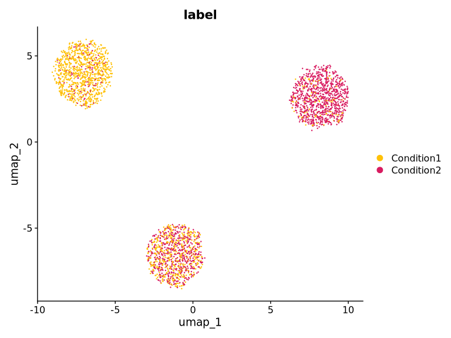
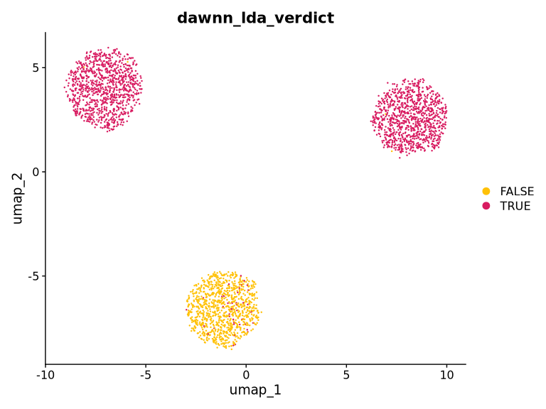
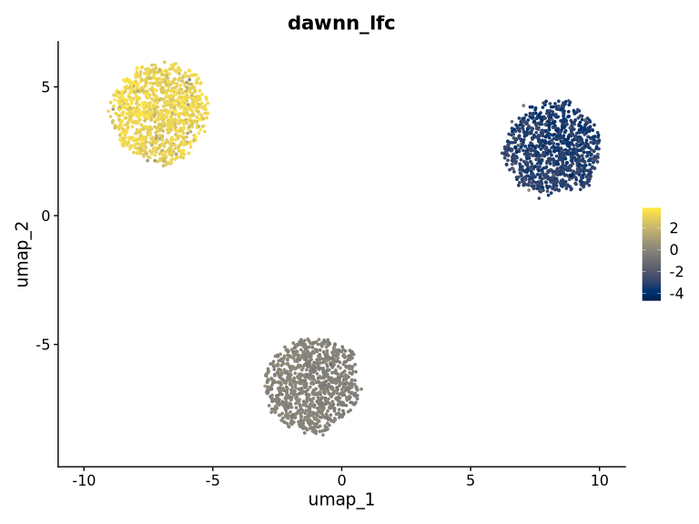
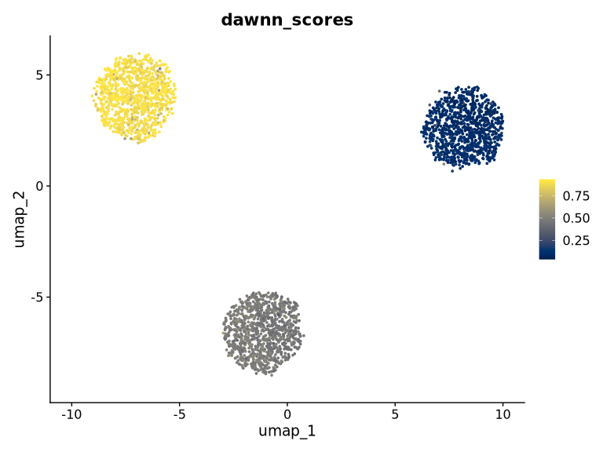
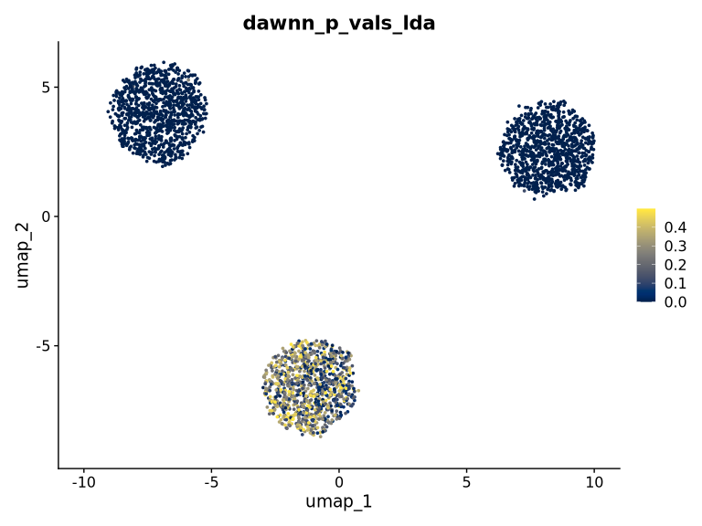

> Copyright (C) 2023- University College London <br>
> Licensed under GNU GPL Version 3 <https://www.gnu.org/licenses/gpl-3.0.html>


<details>
<summary>We have simulated some toy data to demonstrate Dawnn. Click here to display the simulation code.</summary>
We need to first generate a dataset on which we can run Dawnn. We generate
three clusters of cells. In one cluster, we aim to have a 50/50 split of the
labels "Condition1" and "Condition2"; in the second, we aim for a 10/90 split;
and in the third we aim for a 90/10 split. This means that there is
differential abundance in the second and third clusters. We aim to detect this
with Dawnn.


``` r
library(stats)
library(dplyr)
library(Seurat)

set.seed(123)

# Simulate three samples with the expression of 30 genes measured:
#   - Sample 1 is upregulated in the first ten genes
#   - Sample 2 is upregulated in the second ten genes
#   - Sample 3 is upregulated in the third ten genes
sample_1 <- rnbinom(n = 30000, size = 1,
                    prob = c(rep(0.5, 0), rep(0.1, 10), rep(0.5, 20)))
sample_2 <- rnbinom(n = 30000, size = 1,
                    prob = c(rep(0.5, 10), rep(0.1, 10), rep(0.5, 10)))
sample_3 <- rnbinom(n = 30000, size = 1,
                    prob = c(rep(0.5, 20), rep(0.1, 10), rep(0.5, 0)))

ge_vect <- c(sample_1, sample_2, sample_3)
ge_matrix <- matrix(ge_vect, ncol = 3000)
colnames(ge_matrix) <- paste0("cell", 1:3000)
rownames(ge_matrix) <- paste0("gene", 1:30)

cells <- CreateSeuratObject(counts = ge_matrix) %>%
         NormalizeData() %>%
         FindVariableFeatures() %>%
         ScaleData() %>%
         RunPCA() %>%
         RunUMAP(dims = 1:10)

cells$pc1 <- c(rep(0.1, 1000), rep(0.5, 1000), rep(0.9, 1000))
cells$label <- ifelse(runif(3000) <= cells$pc1, "Condition1", "Condition2")
DimPlot(cells, group.by = "label", pt.size = 0.1,
        cols = c("#FFC107", "#D81B60"))
```


</details>

## Installation

Installation instructions are given in the [GitHub
README](https://github.com/george-hall-ucl/dawnn#installation). In this
vignette, we assume that Tensorflow is installed in a conda environment called
`tf_env`, which is not necessarily the same environment that contains Dawnn. A
docker image that will run this vignette is available on DockerHub as
`georgehallucl/dawnn_benchmarking`.

## Main workflow


``` r
library(dawnn)
library(Seurat)
```

Following installation of the Dawnn package, Dawnn model, and Tensorflow Python
package, we are now ready to run the tool.

As in the GitHub README, we assume in the following simple example that `cells`
is a Seurat dataset with \>1000 cells, a PCA reduction, and a `meta.data` slot
`condition_name` that contains the name of the condition to which each cell
belongs (either `Condition1` or `Condition2`).


``` r
cells <- run_dawnn(cells, label_names = "label", label_1 = "Condition1",
                   label_2 = "Condition2", reduced_dim = "pca",
                   tf_conda_env = "tf_env", verbosity = 0)
```

### Required parameters

`run_dawnn` has five parameters that we must specify:

| Parameter | Description |
|-----------|-------------|
| `cells`   | Seurat object containing the dataset |
| `label_names` | `meta.data` slot in `cells` containing labels |
| `label_1` | The label corresponding to the first sample |
| `label_2` | The label corresponding to the second sample |
| `reduced_dim` | Dimensionality reduction to use when calculating KNN graph |

We outline the optional parameters later in this vignette.

### Output

Dawnn's outputs are stored in `meta.data` slots of `cells`. These outputs are:

| Dawnn output             | Description                                                                                   |
|--------------------------|-----------------------------------------------------------------------------------------------|
| `cells$dawnn_[lda/gda]_verdict` | Boolean output of Dawnn for whether a cell is in a region of [local/global] differential abundance.              |
| `cells$dawnn_lfc`        | Estimated log2-fold change in the cell's neighbourhood.                                              |
| `cells$dawnn_scores`     | Estimated probability that the cell was drawn from the sample associated with label_1.                    |
| `cells$dawnn_p_vals_[lda/gda]`     | P-value associated with the hypothesis test that it is in a region of [local/global] differential abundance. |

The first two outputs are likely the most useful. `dawnn_[lda/gda]_verdict`
tells us whether Dawnn has called a cell as being in a region of [local/global]
differential abundance and `dawnn_lfc` contains the estimated log2-fold change
in the abundance of `label_1` and `label_2` in the neighbourhood of each cell.
This second quantity is independent of whether the user is searching for local
or global DA.

Let's first plot the labels of each cell to identify manually which cluster
exhibit differential abundance.


``` r
DimPlot(cells, group.by = "label", pt.size = 0.1,
        cols = c("#FFC107", "#D81B60"))
```


From this, it appears that the cluster at the bottom of the UMAP has a roughly
even split of the two conditions, whilst the other two clusters exhibit
differential abundance towards one of them. We will see whether Dawnn has
detected this by colouring the UMAP according to Dawnn's verdict
(`dawnn_lda_verdict`).


``` r
DimPlot(cells, group.by = "dawnn_lda_verdict", pt.size = 0.1,
        cols = c("#FFC107", "#D81B60"))
```



As expected, Dawnn detects that there is no differential abundance in the
bottom cluster and that there is in the other two.

If we want to investigate the estimated log2-fold change in the abundance of
`Condition1` compared to `Condition2`, we can colour cells according to
`dawnn_lfc`.


``` r
FeaturePlot(cells, "dawnn_lfc") + viridis::scale_color_viridis(option = "cividis")
```



As expected, the two clusters identified as generally exhibiting differential
abundance have estimated log2-fold changes far from 0, whereas for the cluster
at the bottom of the UMAP this quantity is close to 0.

`dawnn_scores` contains the direct output of Dawnn's neural
network, i.e. the estimated probability a cell was drawn from the sample associated
with `label_1` (in our case, `Condition1`). `dawnn_scores` is converted into `dawnn_lfc` with
`log2(cells$dawnn_scores / (1 - cells$dawnn_scores))`.


``` r
FeaturePlot(cells, "dawnn_scores") + viridis::scale_color_viridis(option = "cividis")
```



Finally, `dawnn_p_vals_[lda|gda]` contains, for each cell, the p-value
associated with testing the null hypothesis of "this cell is not in a region of
[local|global] differential abundance". These p-values are used to determine
the calls made in `dawnn_[lda|gda]_verdict`.


``` r
FeaturePlot(cells, "dawnn_p_vals_lda") + viridis::scale_color_viridis(option = "cividis")
```



## Optional parameters

The main function `run_dawnn` has a number of optional parameters:

| Parameter | Description |
|-----------|-------------|
|`nn_model` | String containing the path to the model's .hdf5 file (default `~/.dawnn/dawnn_nn_model.h5`). |
|`recalculate_graph`| Boolean whether to recalculate the KNN graph. If FALSE, then the one stored in the ‘cells’ object will be used (default `TRUE`). |
|`alpha`| Numeric target false discovery rate supplied to the Benjamini–Yekutieli procedure (default 0.1, i.e.  10%). |
| `verbosity` | Integer how much output to print. 0: silent; 1: normal output; 2: display messages from predict() function. (default `2`)|
| `seed` | Integer random seed (default `123`). |

These options can be set as follow:


``` r
cells <- run_dawnn(cells, label_names = "labels", label_1 = "Condition1",
                   label_2 = "Condition2", reduced_dim = "pca",
                   tf_conda_env = "tf_env", n_dims = 20,
                   nn_model = "~/another_dawnn_model.h5",
                   recalculate_graph = FALSE, alpha = 0.05, verbosity = 0,
                   seed = 42)
```

### Changing model location

We can use `download_model`'s `model_file_path` parameter to change the
location to which the model is downloaded. This non-default location must then
be passed to `run_dawnn` using the `nn_model` parameter.


``` r
download_model(..., model_file_path = "~/Documents/new_model_location.h5")
run_dawnn(..., nn_model = "~/Documents/new_model_location.h5")
```

### Downloading a model from another location

A neural network model for Dawnn can be downloaded from a non-default url using
the `model_url` parameter. This might be useful if you have trained a model
with a different `K`, for instance


``` r
download_model(..., model_url = "example.com/another_model_url.h5")
```

## SessionInfo


<details>
<summary>Click to reveal output of `sessionInfo()`</summary>


``` r
sessionInfo()
#> R version 4.4.3 (2025-02-28)
#> Platform: aarch64-conda-linux-gnu
#> Running under: Debian GNU/Linux forky/sid
#> 
#> Matrix products: default
#> BLAS/LAPACK: /root/miniconda3/envs/r_env/lib/libopenblasp-r0.3.30.so;  LAPACK version 3.12.0
#> 
#> locale:
#> [1] C
#> 
#> time zone: Etc/UTC
#> tzcode source: system (glibc)
#> 
#> attached base packages:
#> [1] stats     graphics  grDevices utils     datasets  methods   base     
#> 
#> other attached packages:
#> [1] future_1.67.0      Seurat_5.3.1       SeuratObject_5.2.0 sp_2.2-0          
#> [5] dplyr_1.1.4        dawnn_2.0.0-beta   testthat_3.2.3    
#> 
#> loaded via a namespace (and not attached):
#>   [1] RColorBrewer_1.1-3     rstudioapi_0.17.1      jsonlite_2.0.0        
#>   [4] magrittr_2.0.4         spatstat.utils_3.2-0   rmarkdown_2.30        
#>   [7] farver_2.1.2           fs_1.6.6               vctrs_0.6.5           
#>  [10] ROCR_1.0-11            memoise_2.0.1          spatstat.explore_3.5-3
#>  [13] base64enc_0.1-3        htmltools_0.5.8.1      usethis_3.2.1         
#>  [16] sass_0.4.10            sctransform_0.4.2      parallelly_1.45.1     
#>  [19] bslib_0.9.0            KernSmooth_2.23-26     htmlwidgets_1.6.4     
#>  [22] desc_1.4.3             ica_1.0-3              plyr_1.8.9            
#>  [25] plotly_4.11.0          zoo_1.8-14             cachem_1.1.0          
#>  [28] whisker_0.4.1          igraph_2.1.4           mime_0.13             
#>  [31] lifecycle_1.0.4        pkgconfig_2.0.3        Matrix_1.7-4          
#>  [34] R6_2.6.1               fastmap_1.2.0          fitdistrplus_1.2-4    
#>  [37] shiny_1.11.1           digest_0.6.38          ps_1.9.1              
#>  [40] patchwork_1.3.2        rprojroot_2.1.1        tensor_1.5.1          
#>  [43] RSpectra_0.16-2        irlba_2.3.5.1          pkgload_1.4.1         
#>  [46] labeling_0.4.3         progressr_0.18.0       tfruns_1.5.4          
#>  [49] spatstat.sparse_3.1-0  httr_1.4.7             polyclip_1.10-7       
#>  [52] abind_1.4-8            compiler_4.4.3         remotes_2.5.0         
#>  [55] withr_3.0.2            S7_0.2.0               viridis_0.6.5         
#>  [58] fastDummies_1.7.5      pkgbuild_1.4.8         tensorflow_2.20.0     
#>  [61] MASS_7.3-65            rappdirs_0.3.3         sessioninfo_1.2.3     
#>  [64] tools_4.4.3            lmtest_0.9-40          otel_0.2.0            
#>  [67] httpuv_1.6.16          future.apply_1.20.0    goftest_1.2-3         
#>  [70] glue_1.8.0             callr_3.7.6            nlme_3.1-168          
#>  [73] promises_1.5.0         grid_4.4.3             Rtsne_0.17            
#>  [76] keras_2.16.0           cluster_2.1.8.1        reshape2_1.4.5        
#>  [79] generics_0.1.4         gtable_0.3.6           spatstat.data_3.1-9   
#>  [82] tidyr_1.3.1            data.table_1.17.8      spatstat.geom_3.6-0   
#>  [85] RcppAnnoy_0.0.22       ggrepel_0.9.6          RANN_2.6.2            
#>  [88] pillar_1.11.1          stringr_1.6.0          spam_2.11-1           
#>  [91] RcppHNSW_0.6.0         later_1.4.4            splines_4.4.3         
#>  [94] lattice_0.22-7         survival_3.8-3         deldir_2.0-4          
#>  [97] tidyselect_1.2.1       miniUI_0.1.2           pbapply_1.7-4         
#> [100] knitr_1.50             gridExtra_2.3          scattermore_1.2       
#> [103] xfun_0.54              brio_1.1.5             devtools_2.4.6        
#> [106] matrixStats_1.5.0      stringi_1.8.7          yaml_2.3.10           
#> [109] lazyeval_0.2.2         evaluate_1.0.5         codetools_0.2-20      
#> [112] tibble_3.3.0           cli_3.6.5              uwot_0.2.4            
#> [115] xtable_1.8-4           reticulate_1.44.0      jquerylib_0.1.4       
#> [118] processx_3.8.6         Rcpp_1.1.0             globals_0.18.0        
#> [121] spatstat.random_3.4-2  zeallot_0.2.0          png_0.1-8             
#> [124] spatstat.univar_3.1-4  parallel_4.4.3         ellipsis_0.3.2        
#> [127] ggplot2_4.0.0          dotCall64_1.2          listenv_0.10.0        
#> [130] viridisLite_0.4.2      scales_1.4.0           ggridges_0.5.7        
#> [133] purrr_1.2.0            rlang_1.1.6            cowplot_1.2.0
```

</details>
